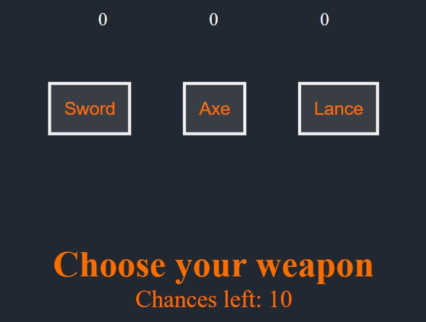
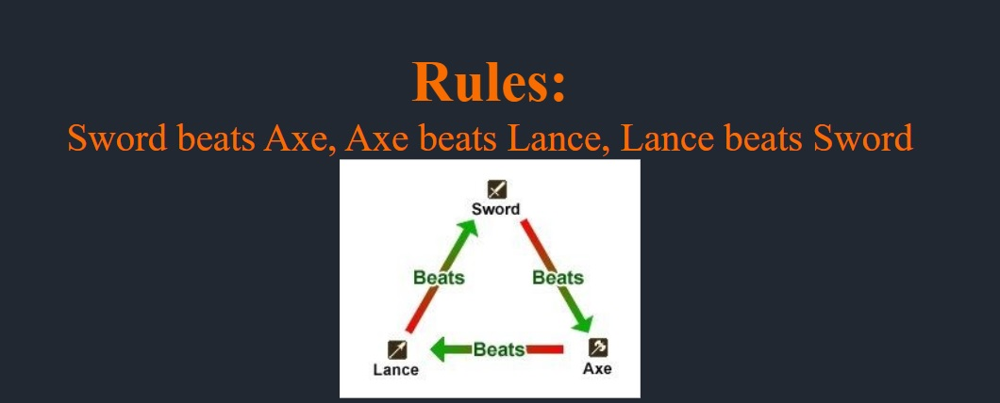

# Sword Axe Lance Game

### This game is like "Rock Papers Scissors" with a fun twist, its three choices of Sword, Axe or Lance. The Sword beats the Axe due to the Swords many different attack patterns. The Axe beats the Lance due to it being able to split the Lance in two. The Lance beats the Sword due to its superior lenght and thrust capabillities.

## Features

* Title
    * The title is a simple design that shows the games name

* Game area
    * Game area with 3 choices and a scorecount for player, computer and a draw

* Footer
    * We also have a footer with the rules of the game

## Testing

* This game is still unfinished

## Bugs

* No known bugs

## Validator Testing

## Unfixed Bugs

## Deployment

## Credits
* The code for the HTML gamepart of the code come from: [Geeksforgeeks](https://www.geeksforgeeks.org/rock-paper-and-scissor-game-using-javascript/).
* Some code in CSS is also from: [Geeksforgeeks](https://www.geeksforgeeks.org/rock-paper-and-scissor-game-using-javascript/).
    * The code from [Geeksforgeeks](https://www.geeksforgeeks.org/rock-paper-and-scissor-game-using-javascript/) was used to increase the time i have to work on the Javascript.
### also
* Used [W3schools](https://www.w3schools.com/js/js_arrays.asp) to remind myself how to make an array for javascript
* Used [W3schools](https://www.w3schools.com/js/js_array_const.asp) to understand that i should use const in some cases in my code