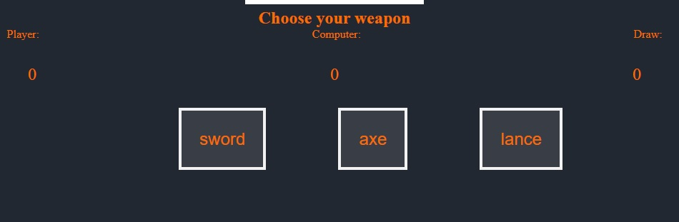

# Sword Axe Lance Game

 This game is like "Rock Papers Scissors" with a fun twist, its three choices of Sword, Axe or Lance. The Sword beats the Axe due to the Swords many different attack patterns. The Axe beats the Lance due to it being able to split the Lance in two. The Lance beats the Sword due to its superior lenght and thrust capabillities.

## Features

* Title
    * The title is a simple design that shows the games name

* Rules
    * A small section of rules with an image to make it easier for the player to undestand the rules

* Game area
    * Game area with three choices and a scorecount for player, computer and a draw

## Testing

The webpage was tested on different screen sizes (samsung galaxy fold, samsung s20ultra, ipad mini and a screen of 1920x1080). The site was also tested on chrome and firefox.

## Technology
* To make this page/game i used the following code languages
    * HTML to structure the site
    * CSS to style the site
    * Javascript to make the gamelogic

## Validator Testing
* HTML
    * No errors were returned when passing through the official [W3C Validator](https://validator.w3.org/nu/?doc=https%3A%2F%2Ftimtechs.github.io%2FCI-Project-2%2F)
* CSS
    * No errors were returned when passing through the official [(Jigsaw) Validator](https://jigsaw.w3.org/css-validator/validator?uri=https%3A%2F%2Ftimtechs.github.io%2FCI-Project-2%2F&profile=css3svg&usermedium=all&warning=1&vextwarning=&lang=sv)
* Javascript
    * No errors were found when passing through the official [Jghint Validator](https://jshint.com/)
        * The following metrics were returned:
        * There are 6 functions in this file.
        * Function with the largest signature takes 2 arguments, while the median is 1.5.
        * Largest function has 7 statements, while the median is 4.
        * The most complex function has a cyclomatic complexity value of 13 while the median is 1.

## Bugs

* Fixed a few bugs
    * userSelection was undefined
    * computerSelection only chose option "sword" or "axe"
    * Redesinged page for easier understanding of rules set

## Unfixed Bugs
* No known current bugs

## Deployment

* The site was deployed to GitHub pages. The steps to deploy are as follows:
    * In the GitHub repository, navigate to the Settings tab
    * From the source section drop-down menu, select the Master Branch
    * Once the master branch has been selected, the page will be automatically refreshed with a detailed ribbon display to indicate the successful deployment.

The live link can be found here - https://timtechs.github.io/CI-Project-2/

## Credits
* Some code for the HTML gamepart of the code come from: [Geeksforgeeks](https://www.geeksforgeeks.org/rock-paper-and-scissor-game-using-javascript/).
* Some code in CSS is also from: [Geeksforgeeks](https://www.geeksforgeeks.org/rock-paper-and-scissor-game-using-javascript/).
    * The code from [Geeksforgeeks](https://www.geeksforgeeks.org/rock-paper-and-scissor-game-using-javascript/) was used to increase the time i have to work on the Javascript.
### also
* Used [W3schools](https://www.w3schools.com/js/js_arrays.asp) to remind myself how to make an array for javascript
* Used [W3schools](https://www.w3schools.com/js/js_array_const.asp) to understand that i should use const in some cases in my code

Also got got help from slack community @Ian Meigh_5P and my mentor Rohit